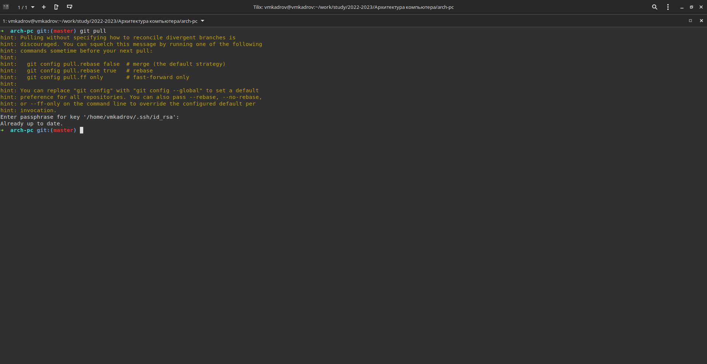
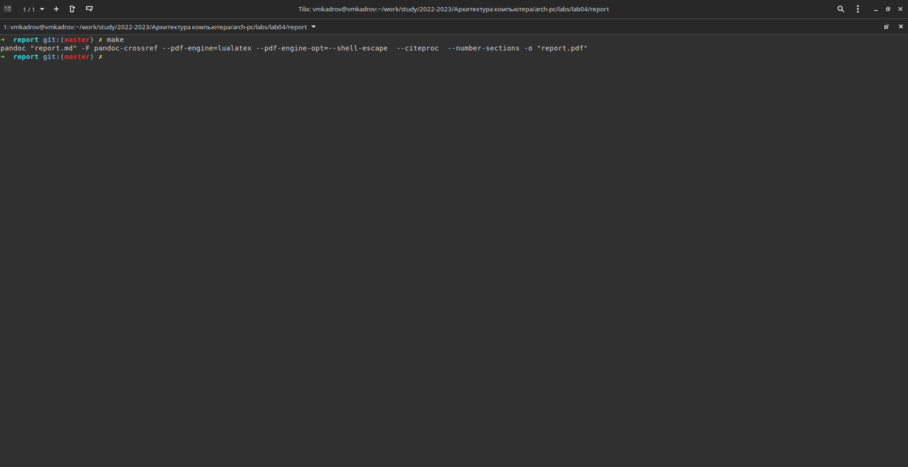
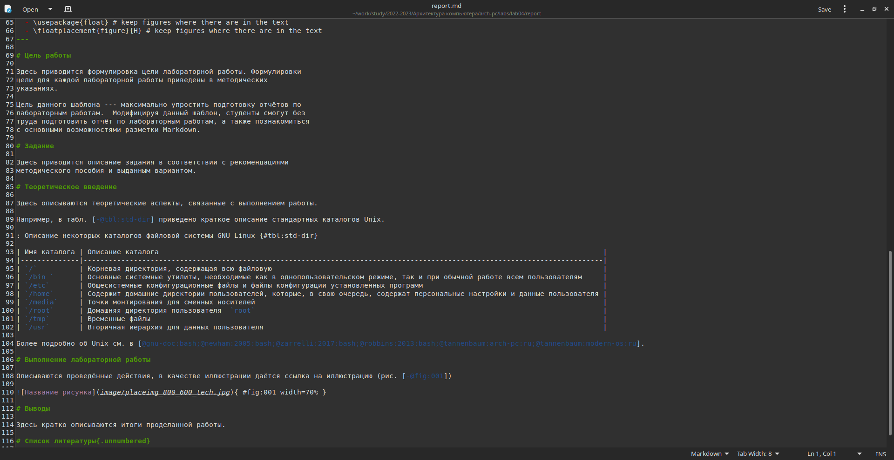
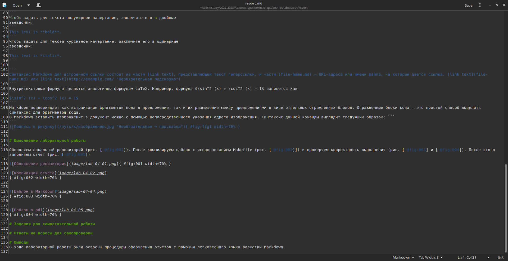
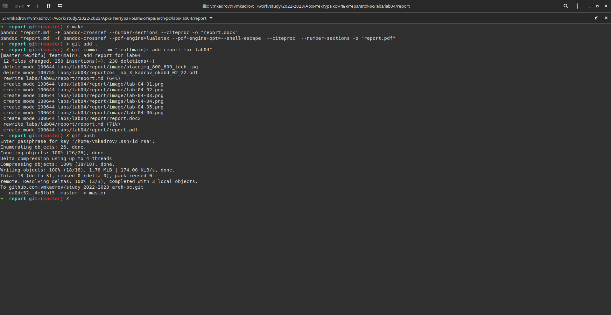
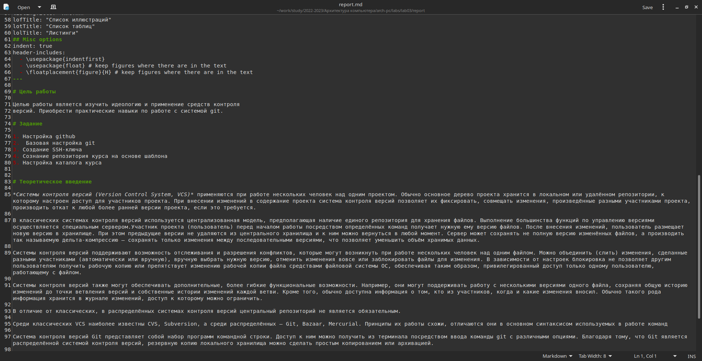

---
## Front matter
title: "Отчет по лабораторной работе №4"
subtitle: "Язык разметки Markdown"
author: "Виктор Максимович Кадров"

## Generic otions
lang: ru-RU
toc-title: "Содержание"

## Bibliography
bibliography: bib/cite.bib
csl: pandoc/csl/gost-r-7-0-5-2008-numeric.csl

## Pdf output format
toc: true # Table of contents
toc-depth: 2
lof: true # List of figures
lot: false # List of tables
fontsize: 12pt
linestretch: 1.5
papersize: a4
documentclass: scrreprt
## I18n polyglossia
polyglossia-lang:
  name: russian
  options:
	- spelling=modern
	- babelshorthands=true
polyglossia-otherlangs:
  name: english
## I18n babel
babel-lang: russian
babel-otherlangs: english
## Fonts
mainfont: PT Serif
romanfont: PT Serif
sansfont: PT Sans
monofont: PT Mono
mainfontoptions: Ligatures=TeX
romanfontoptions: Ligatures=TeX
sansfontoptions: Ligatures=TeX,Scale=MatchLowercase
monofontoptions: Scale=MatchLowercase,Scale=0.9
## Biblatex
biblatex: true
biblio-style: "gost-numeric"
biblatexoptions:
  - parentracker=true
  - backend=biber
  - hyperref=auto
  - language=auto
  - autolang=other*
  - citestyle=gost-numeric
## Pandoc-crossref LaTeX customization
figureTitle: "Рис."
tableTitle: "Таблица"
listingTitle: "Листинг"
lofTitle: "Список иллюстраций"
lotTitle: "Список таблиц"
lolTitle: "Листинги"
## Misc options
indent: true
header-includes:
  - \usepackage{indentfirst}
  - \usepackage{float} # keep figures where there are in the text
  - \floatplacement{figure}{H} # keep figures where there are in the text
---

# Цель работы

Целью работы является освоение процедуры оформления отчетов с помощью легковесного языка разметки Markdown.

# Задание

1. Создание шаблонов отчета при помощ Makefile
2. Заполнение шаблона
3. Загрузка отчетов на github

# Теоретическое введение

*Markdown*  — облегчённый язык разметки, созданный с целью обозначения форматирования в простом тексте, с максимальным сохранением его читаемости человеком, и пригодный для машинного преобразования в языки для продвинутых публикаций (HTML, Rich Text и других).

Чтобы создать заголовок, используйте знак #, например:
```
# This is heading 1
## This is heading 2
### This is heading 3
#### This is heading 4
```
Чтобы задать для текста полужирное начертание, заключите его в двойные
звездочки:
```
This text is **bold**.
```
Чтобы задать для текста курсивное начертание, заключите его в одинарные
звездочки:
```
This text is *italic*.
```

```
Синтаксис Markdown для встроенной ссылки состоит из части [link text], представляющей текст гиперссылки, и части (file-name.md) – URL-адреса или имени файла, на который дается ссылка: [link text](file-name.md) или [link text](http://example.com/ "Необязательная подсказка") 
```
# Выполнение лабораторной работы

Обновляем локальный репозиторий (рис. [-@fig:001]). После компилируем шаблон с использованием Makefile (рис. [-@fig:002]]) и проверяем корректность выполнения (рис. [-@fig:003]). После этого заполняем отчет (рис. [-@fig:004]), компилируем и выгружаем на github (рис. [-@fig:005]).

{#fig:001 width=70%}

{#fig:002 width=70%}


{#fig:003 width=70%}


{#fig:004 width=70%}

{#fig:005 width=70%}

# Задания для самостоятельной работы

Заполняем отчет по лабораторной работе №3 (рис. [-@fig:006]). Затем загружаем его на github.

{#fig:006 width=70%}

# Ответы на воросы для самопроверки

1. *Markdown*  — облегчённый язык разметки, созданный с целью обозначения форматирования в простом тексте, с максимальным сохранением его читаемости человеком, и пригодный для машинного преобразования в языки для продвинутых публикаций (HTML, Rich Text и других).
2. Чтобы задать для текста полужирное начертание, нужно заключить его в двойные звездочки, а чтобы задать для текста курсивное начертание - заключить его в одинарные звездочки.
3. Упорядоченный список можно отформатировать с помощью соответствующих цифр. Чтобы вложить один список в другой, добавьте отступ для элементов дочернего списка. Неупорядоченный (маркированный) список можно отформатировать с помощью звездочек или тире.
4.  В Markdown вставить изображение в документ можно с помощью непосредственного указания адреса изображения.  
5. Внутритекстовые формулы делаются аналогично формулам LaTeX. Например, формула $\sin^2 (x) + \cos^2 (x) = 1$ запишется как
```
$\sin^2 (x) + \cos^2 (x) = 1$
```
# Выводы
В ходе лабораторной работы были освоены процедуры оформления отчетов с помощью легковесного языка разметки Markdown.

