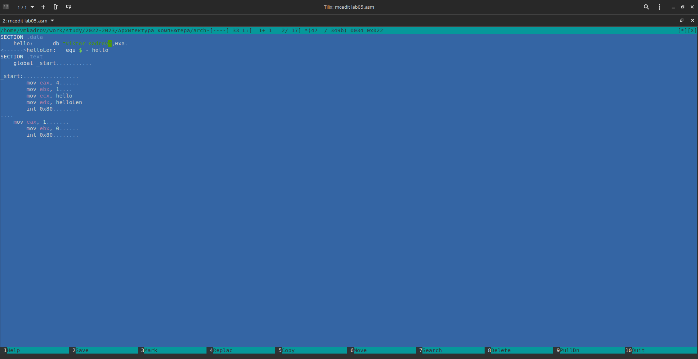
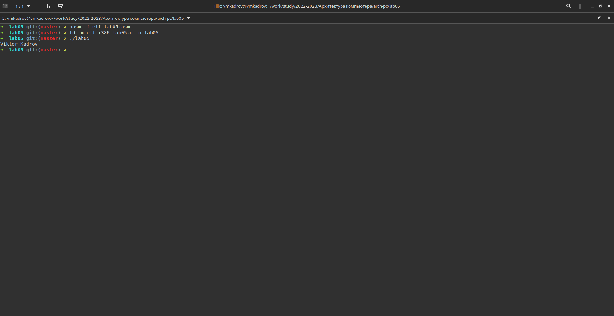

---
## Front matter
title: "Отчет по лабораторной работе №5"
subtitle: " Создание и процесс обработки программ на языке ассемблера NASM"
author: "Виктор Максимович Кадров"

## Generic otions
lang: ru-RU
toc-title: "Содержание"

## Bibliography
bibliography: bib/cite.bib
csl: pandoc/csl/gost-r-7-0-5-2008-numeric.csl

## Pdf output format
toc: true # Table of contents
toc-depth: 2
lof: true # List of figures
lot: false # List of tables
fontsize: 12pt
linestretch: 1.5
papersize: a4
documentclass: scrreprt
## I18n polyglossia
polyglossia-lang:
  name: russian
  options:
	- spelling=modern
	- babelshorthands=true
polyglossia-otherlangs:
  name: english
## I18n babel
babel-lang: russian
babel-otherlangs: english
## Fonts
mainfont: PT Serif
romanfont: PT Serif
sansfont: PT Sans
monofont: PT Mono
mainfontoptions: Ligatures=TeX
romanfontoptions: Ligatures=TeX
sansfontoptions: Ligatures=TeX,Scale=MatchLowercase
monofontoptions: Scale=MatchLowercase,Scale=0.9
## Biblatex
biblatex: true
biblio-style: "gost-numeric"
biblatexoptions:
  - parentracker=true
  - backend=biber
  - hyperref=auto
  - language=auto
  - autolang=other*
  - citestyle=gost-numeric
## Pandoc-crossref LaTeX customization
figureTitle: "Рис."
tableTitle: "Таблица"
listingTitle: "Листинг"
lofTitle: "Список иллюстраций"
lotTitle: "Список таблиц"
lolTitle: "Листинги"
## Misc options
indent: true
header-includes:
  - \usepackage{indentfirst}
  - \usepackage{float} # keep figures where there are in the text
  - \floatplacement{figure}{H} # keep figures where there are in the text
---

# Цель работы

Освоение процедуры компиляции и сборки программ, написанных на ассемблере NASM.

# Задание

1. Написание программ Hello World!, ее трансляция, компоновка и выполнение.
2. Выполнение заданий для самостоятельной работы.
3. Ответы на вопросы для самопроверки.

# Теоретическое введение

Язык ассемблера (assembly language, сокращённо asm) — машинноориентированный язык низкого уровня. 
Можно считать, что он больше любых других языков приближен к архитектуре ЭВМ и её аппаратным возможностям, 
что позволяет получить к ним более полный доступ, нежели в языках высокого уровня, таких как C/C++, Perl, Python и пр.
Программы, написанные на языке ассемблера, не уступают в качестве и скорости программам, написанным на машинном языке, так как транслятор просто
переводит мнемонические обозначения команд в последовательности бит (нулей и единиц).
Используемые мнемоники обычно одинаковы для всех процессоров одной
архитектуры или семейства архитектур (среди широко известных — мнемоники
процессоров и контроллеров x86, ARM, SPARC, PowerPC,M68k). Таким образом
для каждой архитектуры существует свой ассемблер и, соответственно, свой
язык ассемблера.

# Выполнение лабораторной работы

Создаем папку lab05 и файл hello.asm в ней (рис. [-@fig:001]). После этого проверяем, что файл действительно был создан (рис. [-@fig:002]).
Пишем код программы в созданном файле (рис. [-@fig:003]). Транслируем его при помощи NASM в объектный файл (hello.o) и проверяем наличие (рис. [-@fig:004]).
Выплоняем команду с дополнительными ключами (рис. [-@fig:005]). Компонуем и получаем на выходе исполняемый файл (рис. [-@fig:006]), выполняем команду с заданием другого имени (obj.o $\rightarrow$ main) (рис. [-@fig:007]). 
Исполняем его (рис. [-@fig:008]).

{ #fig:001 width=80% }

{ #fig:002 width=80% }

{ #fig:003 width=80% }

{ #fig:004 width=80% }

{ #fig:005 width=80% }

{ #fig:006 width=80% }

{ #fig:007 width=80% }

{ #fig:008 width=80% }

# Задания для самостоятельной работы

Изменяем код програмы в копии файла (рис. [-@fig:009]). Транслируем, компонуем и проверяем, что программа выполняется корректно (рис. [-@fig:010]). Копируем файлы в папку лаб. работы (рис. [-@fig:011]). 
После заполнения отчета загружаем файлы на github.

{ #fig:009 width=80% }

{ #fig:010 width=80% }

{ #fig:011 width=80% }

# Ответы на вопросы для самопроверки

1. Язык уровня ассемблера: язык низкого уровня, который позволяет пользователям писать программы, используя буквенно-цифровые мнемонические коды вместо числового кода для набора инструкций.  
Язык высокого уровня: машинно-независимый язык. Он позволяет пользователю писать программы на языке, который напоминает английские слова и знакомые математические символы. Примерами языков высокого уровня являются python, c# и др.  
Язык ассемблера (assembly language, сокращенно asm) — машинно-ориентированный язык низкого уровня. Можно считать, что он больше любых других языков приближен к архитектуре ЭВМ и её аппаратным возможностям, что позволяет получить к ним более полный доступ, нежели в языках высокого уровня, таких как C/C++, Perl, Python и пр. Заметим, что получить полный доступ к ресурсам компьютера в современных архитектурах нельзя, самым низким уровнем работы прикладной программы является обращение напрямую к ядру операционной системы. Именно на этом уровне и работают программы, написанные на ассемблере. Но в отличие от языков высокого уровня ассемблерная программа содержит только тот код, который ввел программист. Таким образом язык ассемблера — это язык, с помощью которого понятным для человека образом пишутся команды для процессора.

2. Программа на языке ассемблера также может содержать директивы — инструкции, не переводящиеся непосредственно в машинные команды, а управляющие работой транслятора. Например, директивы используются для определения данных (констант и переменных) и обычно пишутся большими буквами.

3. Правила оформления ассемблерных программ
При наборе программ на языке ассемблера придерживайтесь следующих правил:
 * директивы набираются большими буквами, инструкции – малыми;
 * текст пишется широко;
 * не стоит выходить за край экрана – его неудобно будет редактировать и печатать;
 * для отступов используется табуляция (клавиша TAB);
 * блоки комментариев задаются с одинаковым отступом.
Оптимальной считается такая строка:
<TAB><TAB>mov<TAB>eax,<пробел>ebx<(1-3)TAB>;<пробел>текст комментария
Количество табуляций перед комментарием определяется длиной аргументов команды и может быть от 1 до 3.

4. Трансляция и компоновка.

5. Трансляция исходного текста программы состоит в преобразовании предложений исходного языка в коды машинных команд и выполняется с помощью транслятора с языка ассемблера (т. е. с помощью программы ассемблера). 

6. Чтобы получить исполняемую программу, объектный файл необходимо передать на обработку компоновщику.

7. После того, как текст программы набран и записан на жесткий диск, необходимо произвести трансляцию программы. В процессе трансляции создается результирующий (объектный) файл, который представляет собой ту же программу, но в машинных кодах, предназначенную для записи в программную память микроконтроллера. Результирующий файл имеет расширение hex.
Кроме hex-файла транслятор создает еще несколько вспомогательных файлов. И главное, файл с расширением еер. Этот файл имеет точно такую же внутреннюю структуру, как файл hex. А содержит он информацию, предназначенную для записи в EEPROM. Такая информация появляется в том случае, когда в тексте программы переменным, размещенным в сегменте eeprom, присвоены начальные значения. В обоих случаях (hex и eep форматы) применяется так называемый НЕХ-формат, который практически является стандартом для записи результатов транслирования различных программ. Он поддерживается практически всеми трансляторами с любого языка программирования.

8. NASM поддерживает множество форматов выходных файлов, среди них:
 * bin 
 * obj 
 * win32 и win64 
 * aout
 * aoutb
 * coff
 * elf32 и elf64 
Компоновщик ld не предполагает по умолчанию расширений для файлов. Но принято использовать следующие расширения:
 * o для объектных файлов;
 * без расширения для исполняемых файлов;
 * map для файлов схемы программы;
 * lib для библиотек.

# Выводы

В ходе выполнения лабораторной работы были освоены  процедуры компиляции и сборки программ, написанных на ассемблере NASM.
