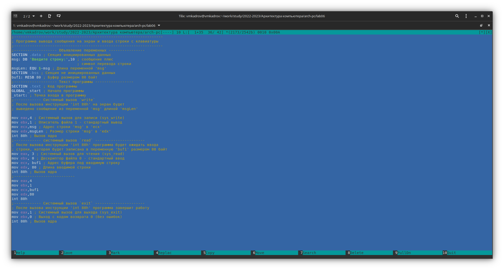

---
## Front matter
title: "Лабораторная работа №6"
subtitle: "Основы работы с
Midnight Commander (mc). Структура
программы на языке ассемблера NASM.
Системные вызовы в ОС GNU Linux"
author: "Виктор Максимович Кадров"

## Generic otions
lang: ru-RU
toc-title: "Содержание"

## Bibliography
bibliography: bib/cite.bib
csl: pandoc/csl/gost-r-7-0-5-2008-numeric.csl

## Pdf output format
toc: true # Table of contents
toc-depth: 2
lof: true # List of figures
lot: false # List of tables
fontsize: 12pt
linestretch: 1.5
papersize: a4
documentclass: scrreprt
## I18n polyglossia
polyglossia-lang:
  name: russian
  options:
	- spelling=modern
	- babelshorthands=true
polyglossia-otherlangs:
  name: english
## I18n babel
babel-lang: russian
babel-otherlangs: english
## Fonts
mainfont: PT Serif
romanfont: PT Serif
sansfont: PT Sans
monofont: PT Mono
mainfontoptions: Ligatures=TeX
romanfontoptions: Ligatures=TeX
sansfontoptions: Ligatures=TeX,Scale=MatchLowercase
monofontoptions: Scale=MatchLowercase,Scale=0.9
## Biblatex
biblatex: true
biblio-style: "gost-numeric"
biblatexoptions:
  - parentracker=true
  - backend=biber
  - hyperref=auto
  - language=auto
  - autolang=other*
  - citestyle=gost-numeric
## Pandoc-crossref LaTeX customization
figureTitle: "Рис."
tableTitle: "Таблица"
listingTitle: "Листинг"
lofTitle: "Список иллюстраций"
lotTitle: "Список таблиц"
lolTitle: "Листинги"
## Misc options
indent: true
header-includes:
  - \usepackage{indentfirst}
  - \usepackage{float} # keep figures where there are in the text
  - \floatplacement{figure}{H} # keep figures where there are in the text
---

# Цель работы

Приобретение практических навыков работы в Midnight Commander. Освоение
инструкций языка ассемблера mov и int.

# Задание

1. Создания программы ввода-вывода
2. Создание программы с использованием внешнего файла
3. Выполнение задания для саомстоятельной работы

# Теоретическое введение

Midnight Commander (или просто mc) — это программа, которая позволяет
просматривать структуру каталогов и выполнять основные операции по управ-
лению файловой системой, т.е. mc является файловым менеджером. Midnight
Commander позволяет сделать работу с файлами более удобной и наглядной.

Программа на языке ассемблера NASM, как правило, состоит из трёх секций:
секция кода программы (SECTION .text), секция инициированных (известных
во время компиляции) данных (SECTION .data) и секция неинициализирован-
ных данных (тех, под которые во время компиляции только отводится память,
а значение присваивается в ходе выполнения программы) (SECTION .bss).

Для объявления инициированных данных в секции .data используются ди-
рективы DB, DW, DD, DQ и DT, которые резервируют память и указывают, какие
значения должны храниться в этой памяти.

# Выполнение лабораторной работы

Создаем папку lab06 и файл lab06-1.asm в ней (рис. [-@fig:001]). Пишем код прогроммы в созданный файл (рис. [-@fig:002]). Создаем исполняемый файл и проверяем, что ввод и вывод происходит корректно (рис. [-@fig:003]). Изменяем код программы так, чтобы для выполнения ввода и вывода использовался код из внешнего файла (рис. [-@fig:004]). Выполняем его (рис. [-@fig:005]). Заменяем в кода программы sprintLf на sprint (рис. [-@fig:006]). После выполнения (рис. [-@fig:007]) можно заметить, что ввод происходит на той же строке, что и вывод.

{ #fig:001 width=100% }

{ #fig:002 width=100% }

{ #fig:003 width=100% }

{ #fig:004 width=100% }

{ #fig:005 width=100% }

{ #fig:006 width=100% }

{ #fig:007 width=100% }

# Задания для самостоятельной работы

Изменяем код lab06-1 так, чтобы введенная строка выводилась на экран (рис. [-@fig:008]). Проверяем, что все выполняется корректно (рис. [-@fig:009]). Аналогично меняем код lab06-2 (рис. [-@fig:010]) и проверяем результат (рис. [-@fig:011]). 

{ #fig:008 width=100% }

{ #fig:009 width=100% }

{ #fig:010 width=100% }

{ #fig:011 width=100% }

# Выводы

В ходе выполнения лабораторной работы были приобретены практические навыкы работы в Midnight Commander. Также были освоены инструкции языка ассемблера mov и int.

