---
## Front matter
title: "Отчет по лабораторной работе №7"
subtitle: "Арифметические операции в NASM"
author: "Виктор Максимович Кадров"

## Generic otions
lang: ru-RU
toc-title: "Содержание"

## Bibliography
bibliography: bib/cite.bib
csl: pandoc/csl/gost-r-7-0-5-2008-numeric.csl

## Pdf output format
toc: true # Table of contents
toc-depth: 2
lof: true # List of figures
lot: false # List of tables
fontsize: 12pt
linestretch: 1.5
papersize: a4
documentclass: scrreprt
## I18n polyglossia
polyglossia-lang:
  name: russian
  options:
	- spelling=modern
	- babelshorthands=true
polyglossia-otherlangs:
  name: english
## I18n babel
babel-lang: russian
babel-otherlangs: english
## Fonts
mainfont: PT Serif
romanfont: PT Serif
sansfont: PT Sans
monofont: PT Mono
mainfontoptions: Ligatures=TeX
romanfontoptions: Ligatures=TeX
sansfontoptions: Ligatures=TeX,Scale=MatchLowercase
monofontoptions: Scale=MatchLowercase,Scale=0.9
## Biblatex
biblatex: true
biblio-style: "gost-numeric"
biblatexoptions:
  - parentracker=true
  - backend=biber
  - hyperref=auto
  - language=auto
  - autolang=other*
  - citestyle=gost-numeric
## Pandoc-crossref LaTeX customization
figureTitle: "Рис."
tableTitle: "Таблица"
listingTitle: "Листинг"
lofTitle: "Список иллюстраций"
lotTitle: "Список таблиц"
lolTitle: "Листинги"
## Misc options
indent: true
header-includes:
  - \usepackage{indentfirst}
  - \usepackage{float} # keep figures where there are in the text
  - \floatplacement{figure}{H} # keep figures where there are in the text
---

# Цель работы

Освоение арифметических инструкций языка ассемблера NASM.

# Задание

1. Символьные и численные данные в NASM.
2. Выполнение арифметических операций в NASM.
3. Ответы на вопросы.
4. Выполнение заданий для самостоятельной работы.

# Теоретическое введение

Язык ассемблера (assembly language, сокращённо asm) — машинноориентированный язык низкого уровня. 
Можно считать, что он больше любых других языков приближен к архитектуре ЭВМ и её аппаратным возможностям, 
что позволяет получить к ним более полный доступ, нежели в языках высокого уровня, таких как C/C++, Perl, Python и пр.
Программы, написанные на языке ассемблера, не уступают в качестве и скорости программам, написанным на машинном языке, так как транслятор просто
переводит мнемонические обозначения команд в последовательности бит (нулей и единиц).
Используемые мнемоники обычно одинаковы для всех процессоров одной
архитектуры или семейства архитектур (среди широко известных — мнемоники
процессоров и контроллеров x86, ARM, SPARC, PowerPC,M68k). Таким образом
для каждой архитектуры существует свой ассемблер и, соответственно, свой
язык ассемблера.

# Выполнение лабораторной работы

## Символьные и численные данные в NASM.

Создаем папку lab07 и файл lab07-1.asm в ней (рис. [-@fig:001]). Пишем код программы, выводящей значение регистра (рис. [-@fig:002]). Выполняем команду и проверяем вывод (рис. [-@fig:003]).
Изменяем код программы так, чтобы в регистр записывались числа, а не символы. (рис. [-@fig:004]). Выполняем ее (рис. [-@fig:005]). В соответствии с таблцей кодирования ASCII, код 10 соответствует символу переноса каретки, поэтому на экране он не отображается. Записываем в файл lab07-2.asm код программы (рис. [-@fig:006]), выводящей значение регистра без перевода в ASCII, и выполняем ее (рис. [-@fig:007]). Изменяем код аналогично lab-07-1.asm (рис. [-@fig:008]) и выполняем (рис. [-@fig:009]). В результате в консоль выводится значение регистра без перевода в ASCII. После этого меняем функцию iprintLF на iprint. Их откличие заключается в том, что первая выводит строку и добавляет символ переноса каретки.

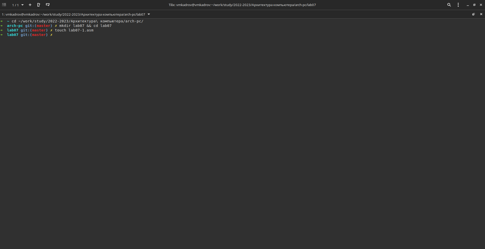{ #fig:001 width=80% }

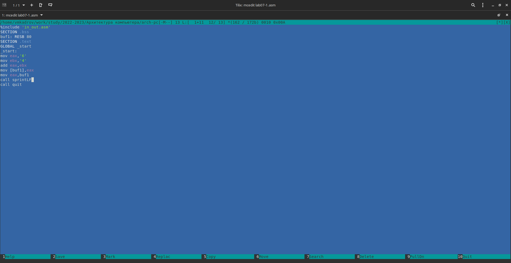{ #fig:002 width=80% }

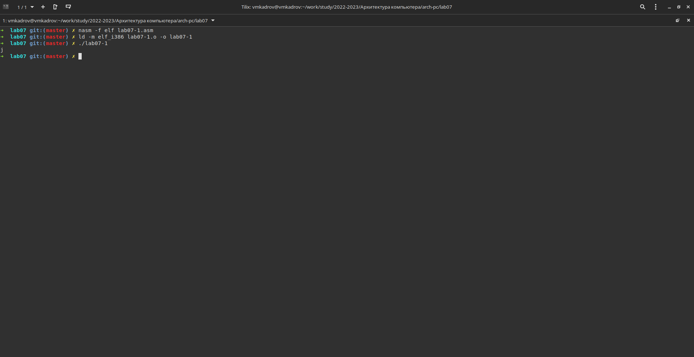{ #fig:003 width=80% }

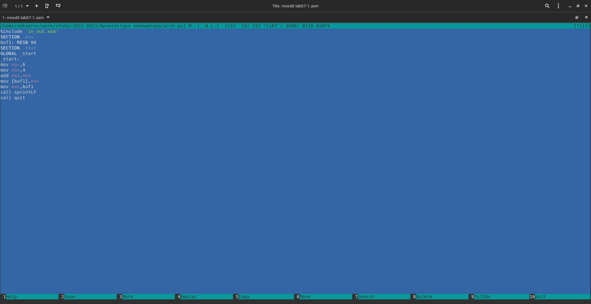{ #fig:004 width=80% }

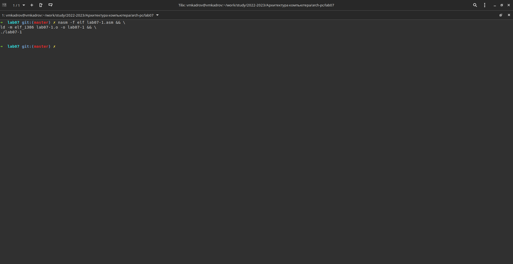{ #fig:005 width=80% }

{ #fig:006 width=80% }

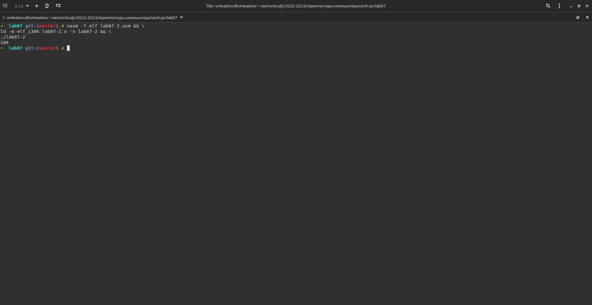{ #fig:007 width=80% }

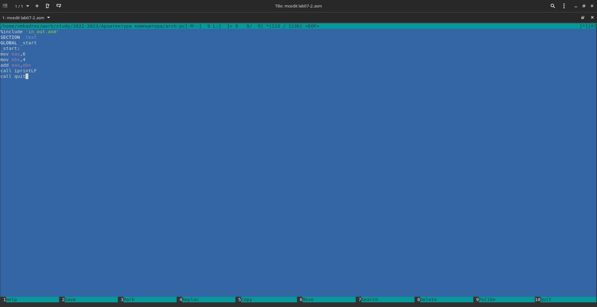{ #fig:008 width=80% }

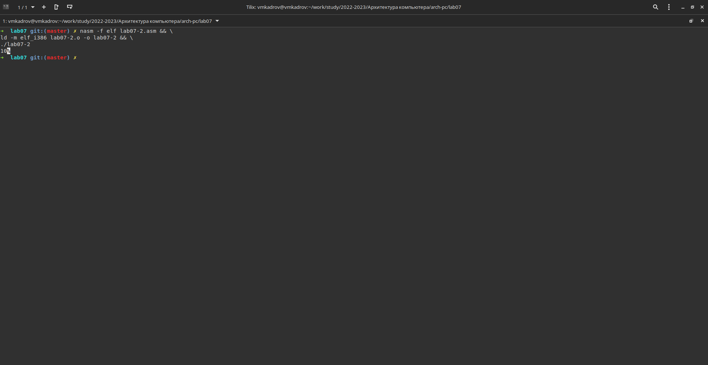{ #fig:009 width=80% }

## Выполнение арифметических операций в NASM.

Создаем файл lab07-3.asm и пишем туда код программы (рис. [-@fig:010]), считающей результат арифметического выражения. Выполняем ее и проверяем корректность вывода (рис. [-@fig:011]). Изменяем код так, чтобы программы считала другое выражение (рис. [-@fig:012]). Выпоняем его (рис. [-@fig:013]). Создаем файл variant.asm и пишем туда код программы, расcчитывающей номер варианта (рис. [-@fig:014]) и выполняем ее (рис. [-@fig:015]).

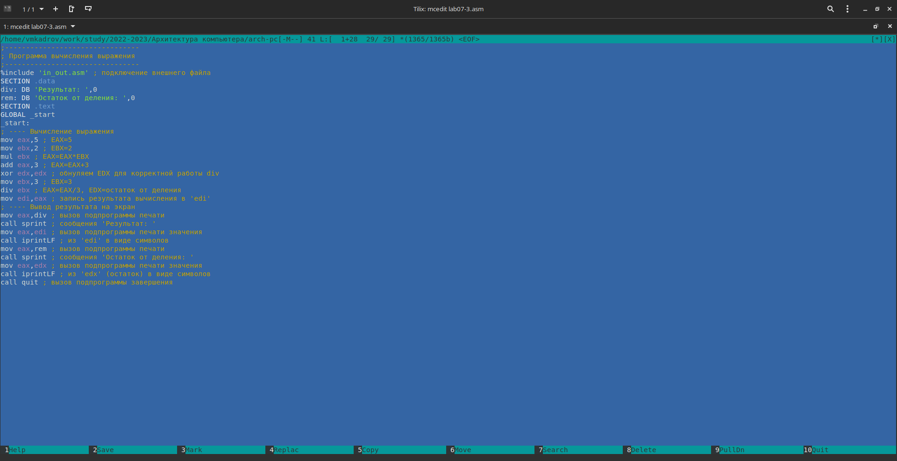{ #fig:010 width=80% }

{ #fig:011 width=80% }

{ #fig:012 width=80% }

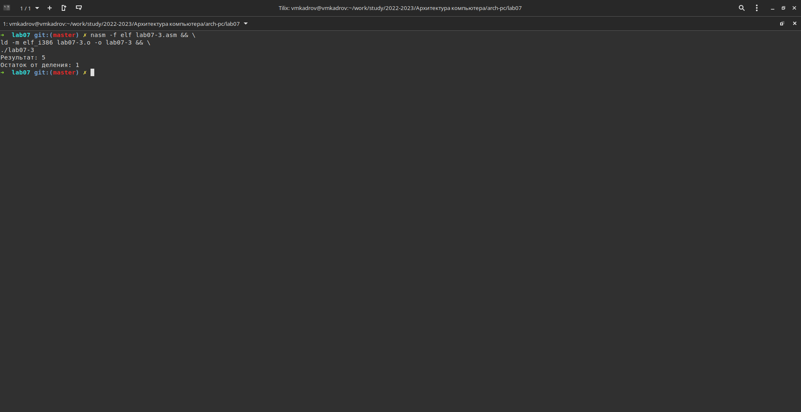{ #fig:013 width=80% }

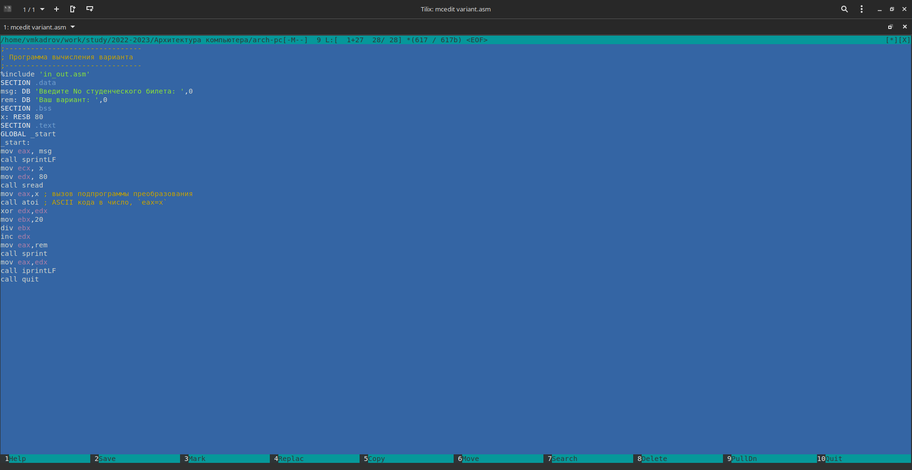{ #fig:014 width=80% }

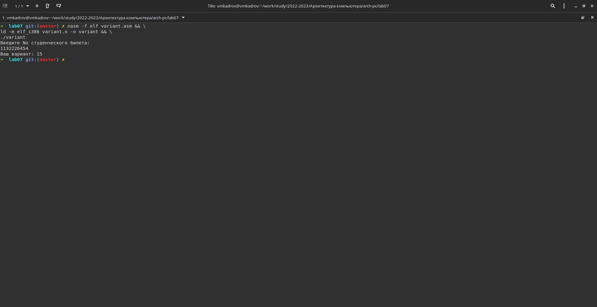{ #fig:015 width=80% }

# Ответы на вопросы

1. За вывод этого сообщения отвечают строки 
```
mov eax,rem 
call sprint
```
2. Эти инструкции используются для ввода значения переменной с клавиатуры
3. Функция atoi преобразует значение в регистре из кода в символ ASCII.
4. За вычисление варианта отвечают следующие строки:
```
xor edx,edx
mov ebx,20
div ebx
inc edx
```
5. Остаток от деления записывается в регистр edx
6. inc - инкрементация, то есть прибавление единицы к значению в регистре.
7. За вывод результата вычислений отечают строки
```
mov eax,edx
call iprintLF
```

# Задания для самостоятельной работы

Пишем код программы в соответствии с вариантом (рис. [-@fig:016]). Выполняем его и проверяем корректность на двух значениях x (рис. [-@fig:017]).

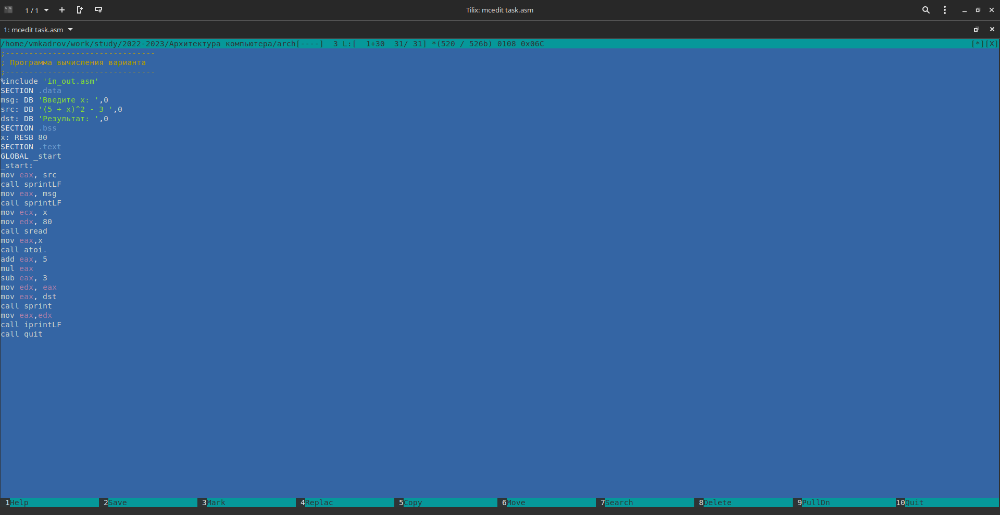{ #fig:016 width=80% }

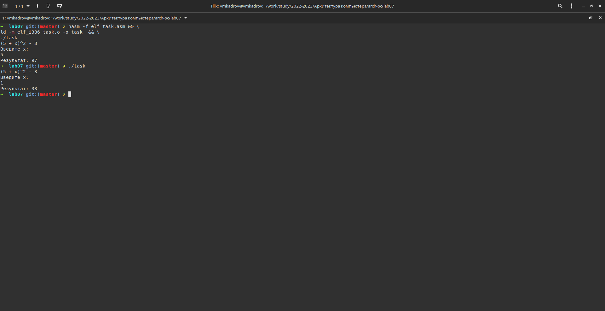{ #fig:017 width=80% }

# Выводы

В ходе выполнения лабораторной работы были освоены арифметические инструкции языка ассемблера NASM.
